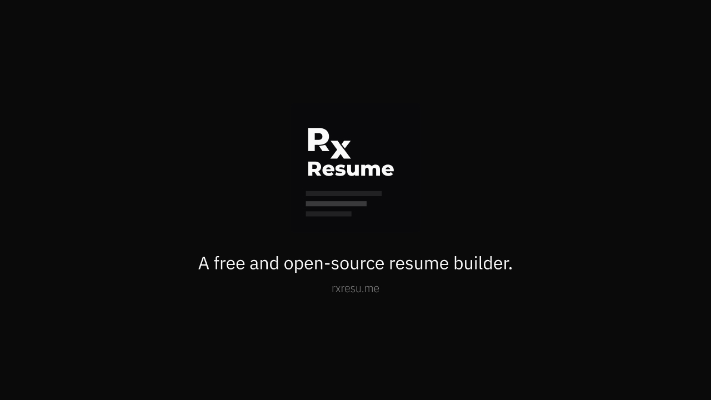
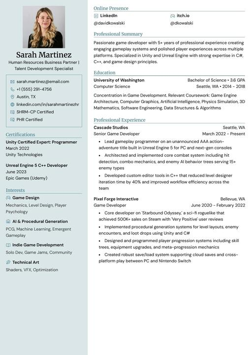
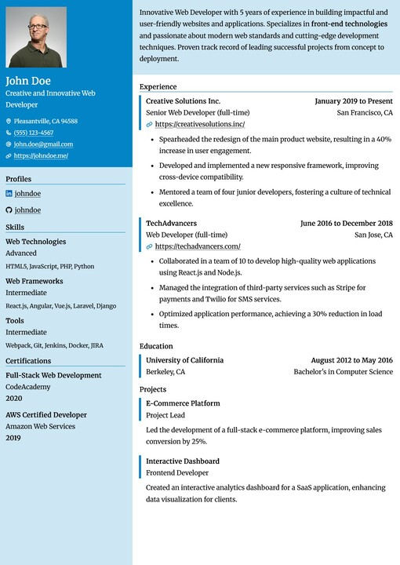

<div align="center">
  <a href="https://rxresu.me">
    
  </a>

  <h1>Reactive Resume</h1>

  <p>Reactive Resume is a free and open-source resume builder that makes it easy to create, update, and share your resume.</p>

  <p>
    <a href="https://rxresu.me"><strong>Get Started</strong></a>
    ·
    <a href="https://docs.rxresu.me"><strong>Learn More</strong></a>
  </p>

  <p>
    
    
    
    
    <a href="https://discord.gg/aSyA5ZSxpb"></a>
    <a href="https://crowdin.com/project/reactive-resume"></a>
    <a href="https://github.com/sponsors/AmruthPillai"></a>
    <a href="https://opencollective.com/reactive-resume/donate"></a>
  </p>
</div>

---

Pick a template, fill in your details, and export to PDF. Basic use needs no account. If you want more control, you can run the whole application on your own infrastructure.

You own your data. The codebase is open source under the MIT license, with no tracking, no ads, and no hidden costs.

## Sponsors

Sponsors pay for hosting, maintenance, and ongoing development, which is what keeps Reactive Resume free and independent. Thank you to everyone who chips in.

<p>
  <a href="https://www.atlascloud.ai/?utm_source=github&utm_medium=link&utm_campaign=reactive-resume">
    
  </a>
</p>

[Atlas Cloud](https://www.atlascloud.ai/?utm_source=github&utm_medium=link&utm_campaign=reactive-resume) supports Reactive Resume as a project sponsor. Atlas Cloud provides a unified AI platform for developers, with access to hundreds of models for chat, image generation, video generation, media processing, and GPU cloud workloads through one API key, one endpoint, and one billing account.

If your company would like to sponsor Reactive Resume, email [hello@amruthpillai.com](mailto:hello@amruthpillai.com).

## Features

**Resume Building**

- Live preview as you type
- Multiple export formats (PDF, JSON, DOCX)
- Drag-and-drop section ordering
- Custom sections for any content type
- Rich text editor

**Templates**

- 15 templates to choose from
- A4 and Letter page sizes
- Customizable colors, fonts, and spacing
- Structured Style Rules for section and text styling

**Privacy & Control**

- Self-host on your own infrastructure
- No tracking or analytics by default
- Full data export at any time
- Delete your data permanently with one click

**Extras**

- AI integration (OpenAI, Google Gemini, Anthropic Claude)
- Multi-language support
- Share resumes via unique links
- Import from JSON Resume format
- Dark mode
- Passkey and two-factor authentication

## Templates

<table>
  <tr>
    <td align="center">
      
      <br /><sub><b>Azurill</b></sub>
    </td>
    <td align="center">
      
      <br /><sub><b>Bronzor</b></sub>
    </td>
    <td align="center">
      
      <br /><sub><b>Chikorita</b></sub>
    </td>
    <td align="center">
      
      <br /><sub><b>Ditto</b></sub>
    </td>
  </tr>
  <tr>
    <td align="center">
      
      <br /><sub><b>Gengar</b></sub>
    </td>
    <td align="center">
      
      <br /><sub><b>Glalie</b></sub>
    </td>
    <td align="center">
      
      <br /><sub><b>Kakuna</b></sub>
    </td>
    <td align="center">
      
      <br /><sub><b>Lapras</b></sub>
    </td>
  </tr>
  <tr>
    <td align="center">
      
      <br /><sub><b>Leafish</b></sub>
    </td>
    <td align="center">
      
      <br /><sub><b>Onyx</b></sub>
    </td>
    <td align="center">
      
      <br /><sub><b>Pikachu</b></sub>
    </td>
    <td align="center">
      
      <br /><sub><b>Rhyhorn</b></sub>
    </td>
  </tr>
  <tr>
    <td align="center">
      
      <br /><sub><b>Ditgar</b></sub>
    </td>
    <td align="center">
      
      <br /><sub><b>Meowth</b></sub>
    </td>
    <td align="center">
      
      <br /><sub><b>Scizor</b></sub>
    </td>
  </tr>
</table>

## Quick Start

The quickest way to run Reactive Resume locally:

```bash
# Clone the repository
git clone --depth=1  https://github.com/amruthpillai/reactive-resume.git
cd reactive-resume

# Start all services
docker compose up -d

# Access the app
open http://localhost:3000
```

[](https://app.ona.com/#https://github.com/amruthpillai/reactive-resume)

For detailed setup instructions, environment configuration, and self-hosting guides, see the [documentation](https://docs.rxresu.me).

## Tech Stack

| Category         | Technology                      |
| ---------------- | ------------------------------- |
| Framework        | TanStack Start (React 19, Vite) |
| Runtime          | Node.js                         |
| Language         | TypeScript                      |
| Database         | PostgreSQL with Drizzle ORM     |
| API              | ORPC (Type-safe RPC)            |
| Auth             | Better Auth                     |
| Styling          | Tailwind CSS                    |
| UI Components    | Base UI + shadcn-style package  |
| State Management | Zustand + TanStack Query        |

## Documentation

The full documentation lives at [docs.rxresu.me](https://docs.rxresu.me):

| Guide                                                                        | Description                      |
| ---------------------------------------------------------------------------- | -------------------------------- |
| [Getting Started](https://docs.rxresu.me/getting-started)                    | First-time setup and basic usage |
| [Self-Hosting](https://docs.rxresu.me/self-hosting/docker)                   | Deploy on your own server        |
| [Development setup](https://docs.rxresu.me/contributing/development)         | Local development environment    |
| [Project architecture](https://docs.rxresu.me/contributing/architecture)     | Codebase structure and patterns  |
| [Exporting Your Resume](https://docs.rxresu.me/guides/exporting-your-resume) | PDF and JSON export options      |

## Self-Hosting

Reactive Resume can be self-hosted using Docker. The stack includes:

- **PostgreSQL** — Database for storing user data and resumes
- **SeaweedFS** (optional) — S3-compatible storage for file uploads

> **From v5.1.0 onwards** — PDF generation runs entirely client-side via `@react-pdf/renderer`. New deployments no longer need Browserless, Chromium, or any external print service. The `PRINTER_*` and `BROWSERLESS_*` environment variables are no longer read and can be removed from your `.env`.

Pull the latest image from Docker Hub or GitHub Container Registry:

```bash
# Docker Hub
docker pull amruthpillai/reactive-resume:latest

# GitHub Container Registry
docker pull ghcr.io/amruthpillai/reactive-resume:latest
```

See the [self-hosting guide](https://docs.rxresu.me/self-hosting/docker) for complete instructions.

## Support

Reactive Resume is and always will be free and open source. If it has helped you land a job or saved you time, please consider supporting continued development:

<p>
  <a href="https://github.com/sponsors/AmruthPillai">
    
  </a>
  <a href="https://opencollective.com/reactive-resume/donate">
    
  </a>
</p>

Other ways to support:

- Star this repository
- Report reproducible bugs and suggest actionable features
- Help other users in [GitHub Discussions](https://github.com/amruthpillai/reactive-resume/discussions/categories/q-a)
- Improve documentation
- Help with translations

## Star History

<a href="https://www.star-history.com/?repos=amruthpillai%2Freactive-resume&type=date&legend=top-left">
 <picture>
   <source media="(prefers-color-scheme: dark)" srcset="https://api.star-history.com/chart?repos=amruthpillai/reactive-resume&type=date&theme=dark&legend=top-left&sealed_token=QmaOn4Ech499R6kpQe8ONn911UjGUaJfQBT0MXlQLU9hTo-Ie7lTxIILWbBvmtzDGHk7ziWKN_N5iM5mgP8widn_FGHd9-PHNokPtSji8XLgbFpqatgyqIDPnOys-IhO40W3J0HeH07FL-Q8Bq6ArRk3LDtJDwjh4m0ya-2L59ULb7BaqxkSDuCytkCr" />
   <source media="(prefers-color-scheme: light)" srcset="https://api.star-history.com/chart?repos=amruthpillai/reactive-resume&type=date&legend=top-left&sealed_token=QmaOn4Ech499R6kpQe8ONn911UjGUaJfQBT0MXlQLU9hTo-Ie7lTxIILWbBvmtzDGHk7ziWKN_N5iM5mgP8widn_FGHd9-PHNokPtSji8XLgbFpqatgyqIDPnOys-IhO40W3J0HeH07FL-Q8Bq6ArRk3LDtJDwjh4m0ya-2L59ULb7BaqxkSDuCytkCr" />
   
 </picture>
</a>

## Contributing

Every contribution helps, whether it is a typo fix or a new feature.

1. Fork the repository
2. Create a feature branch (`git checkout -b feature/amazing-feature`)
3. Commit your changes (`git commit -m 'Add amazing feature'`)
4. Push to the branch (`git push origin feature/amazing-feature`)
5. Open a Pull Request

See the [development setup guide](https://docs.rxresu.me/contributing/development) for how to run the project locally.

Maintainers review the [`status: needs triage` queue](https://github.com/amruthpillai/reactive-resume/issues?q=is%3Aissue+is%3Aopen+label%3A%22status%3A+needs+triage%22)
weekly. Triaged bugs become `status: confirmed`; feature proposals become `status: accepted`; reports that need details become
`status: needs info`.

## License

[MIT](./LICENSE) — do whatever you want with it.


## 🌐 Web Resources & Interactive Index
- [SLINGER BLOCK](https://studyquesthub.web.app/slinger-block.html)
- [CATEGORY MAHJONG GAMES](https://quizverses.github.io/category-mahjong-games.html)
- [MR LONG HAND](https://quizverses-9d2f2.web.app/mr-long-hand.html)
- [STEAL BRAINROT DUEL](https://quizverses.github.io/steal-brainrot-duel.html)
- [DIY MAKEUP SALON SPA MAKEOVER STUDIO](https://thequizzone.pages.dev/diy-makeup-salon-spa-makeover-studio.html)
- [CATEGORY COLOR197](https://quizverses.github.io/category-color197.html)
- [OBBY THE LEGENDARY DRAGON](https://quizverses-9d2f2.web.app/obby-the-legendary-dragon.html)
- [CUPIDS STORY LOVE ARCHER BOW](https://quizverses-9d2f2.web.app/cupids-story-love-archer-bow.html)
- [CATEGORY CONTROLLER59](https://quizverses-9d2f2.web.app/category-controller59.html)
- [HEXANAUT IO](https://quizverses.github.io/hexanaut-io.html)
- [CATEGORY CUTE62](https://quizverses.github.io/category-cute62.html)
- [ARCHERY MASTER BOW AND ARROW](https://quizverses-9d2f2.web.app/archery-master-bow-and-arrow.html)
- [PEOPLE PLAYGROUND 3D](https://quizverses.github.io/people-playground-3d.html)
- [TROLLEY FUN](https://quizverses.github.io/trolley-fun.html)
- [CATEGORY JIGSAW10](https://quizverses.pages.dev/category-jigsaw10.html)
- [KINDER GARDEN](https://quizverses.github.io/kinder-garden.html)
- [STEAM SORTER](https://quizverses.github.io/steam-sorter.html)
- [VEGAMIX MATCH 3 VILLAGE](https://quizverses.github.io/vegamix-match-3-village.html)
- [REAL MOTORBIKE SIMULATOR RACE 3D](https://quizverses-9d2f2.web.app/real-motorbike-simulator-race-3d.html)
- [QUACKVENTURE](https://quizverses.pages.dev/quackventure.html)
- [DINO SLIDE](https://quizverses-9d2f2.web.app/dino-slide.html)
- [ZIG SNAKE](https://quizverses.github.io/zig-snake.html)
- [SQUID SPRUNKI SLITHER GAME 2](https://quizverses.github.io/squid-sprunki-slither-game-2.html)
- [MURDER](https://quizverses.github.io/murder.html)
- [MATH CROSSWORD PUZZLE GENIUS EDITION](https://quizverses.github.io/math-crossword-puzzle-genius-edition.html)
- [DEADFLIP FRENZY](https://quizverses-9d2f2.web.app/deadflip-frenzy.html)
- [DINOSAUR CARDS](https://quizverses.github.io/dinosaur-cards.html)
- [MERGE TOWN](https://quizverses-9d2f2.web.app/merge-town.html)
- [GEOMETRY LITE](https://quizverses.github.io/geometry-lite.html)
- [SNAKE IO](https://quizverses.github.io/snake-io.html)
- [GUMMY MERGE](https://quizverses.github.io/gummy-merge.html)
- [REACH 2048](https://quizverses.github.io/reach-2048.html)
- [CATEGORY PLATFORM260](https://quizverses-9d2f2.web.app/category-platform260.html)
- [CATEGORY DRESS UP 2](https://studyquests.github.io/category-dress-up-2.html)
- [FAST LAP](https://quizverses.pages.dev/fast-lap.html)
- [OHPEACH IT](https://quizverses.pages.dev/ohpeach-it.html)
- [CATEGORY CARE](https://quizverses.github.io/category-care.html)
- [CATEGORY 3D1 383](https://studyquests.github.io/category-3d1-383.html)
- [FUNNY BALLS 2048](https://quizverses.pages.dev/funny-balls-2048.html)
- [JOIN CLASH COLOR BUTTON](https://quizverses.pages.dev/join-clash-color-button.html)
- [JUNGLE SOLITAIRE](https://quizverses.pages.dev/jungle-solitaire.html)
- [GOING BALLS 3D](https://quizverses.github.io/going-balls-3d.html)
- [CATEGORY CAN T STOP PLAYING212](https://quizverses.github.io/category-can-t-stop-playing212.html)
- [GANGSTA ISLAND CRIME CITY](https://quizverses.pages.dev/gangsta-island-crime-city.html)
- [MATCH ARENA](https://quizverses.pages.dev/match-arena.html)
- [STELLAR STYLE SPECTACLE FASHION](https://quizverses.pages.dev/stellar-style-spectacle-fashion.html)
- [PUZZLE WOOD BLOCK](https://quizverses-9d2f2.web.app/puzzle-wood-block.html)
- [CATEGORY CASUAL971](https://quizverses.github.io/category-casual971.html)
- [KICK AND RIDE](https://quizverses.github.io/kick-and-ride.html)
- [ELEMENTAL GLOVES MAGIC POWER](https://quizverses.github.io/elemental-gloves-magic-power.html)
- [RAMP CAR JUMPING](https://quizverses.pages.dev/ramp-car-jumping.html)
- [OBBY POGO PARKOUR](https://quizverses.github.io/obby-pogo-parkour.html)
- [DOMINO WORLD](https://quizverses.pages.dev/domino-world.html)
- [CATEGORY CAN T STOP PLAYING215](https://quizverses.github.io/category-can-t-stop-playing215.html)
- [DRAW WEAPON FIGHT PARTY](https://quizverses.pages.dev/draw-weapon-fight-party.html)
- [GUN RACING](https://quizverses.github.io/gun-racing.html)
- [PUPPY MERGE](https://quizverses-9d2f2.web.app/puppy-merge.html)
- [SPRUNKY INCREDIBOX MODS](https://quizverses.pages.dev/sprunky-incredibox-mods.html)
- [JINN DASH](https://quizverses.pages.dev/jinn-dash.html)
- [CATEGORY COLLECT566](https://quizverses.github.io/category-collect566.html)
- [OBBY DRAW TO ESCAPE](https://quizverses.pages.dev/obby-draw-to-escape.html)
- [FLOW BLOCK](https://quizverses.pages.dev/flow-block.html)
- [SITEMAP](https://quizverses.pages.dev/sitemap.html)
- [BEAUTY PUZZLE](https://quizverses.pages.dev/beauty-puzzle.html)
- [KITTY MATCH 3 PUZZLE GAME](https://quizverses.github.io/kitty-match-3-puzzle-game.html)
- [WONDERS OF EGYPT MATCH](https://quizverses.pages.dev/wonders-of-egypt-match.html)
- [CATEGORY THINKY 2](https://quizverses.github.io/category-thinky-2.html)
- [MERGEDUELIO](https://quizverses.pages.dev/mergeduelio.html)
- [BOMBER BATTLE ARENA](https://quizverses.pages.dev/bomber-battle-arena.html)
- [100 DOORS PUZZLE BOX](https://quizverses.github.io/100-doors-puzzle-box.html)
- [SHOOT RUN MONSTER HUNTING](https://quizverses.pages.dev/shoot-run-monster-hunting.html)
- [WORM PUZZLE SNAKE APPLE](https://quizverses-9d2f2.web.app/worm-puzzle-snake-apple.html)
- [ZOMBIE ARENA 2 FURY ROAD](https://quizverses.pages.dev/zombie-arena-2-fury-road.html)
- [CATEGORY CLASSIC97](https://quizverses.github.io/category-classic97.html)
- [HIDDEN OBJECT ADVENTURE](https://quizverses.github.io/hidden-object-adventure.html)
- [FRUIT MERGE JUICY DROP GAME](https://quizverses-9d2f2.web.app/fruit-merge-juicy-drop-game.html)
- [MOTO TRIALS RUSH](https://quizverses.github.io/moto-trials-rush.html)
- [MONEY PING PONG](https://quizverses.github.io/money-ping-pong.html)
- [CRAFTSMAN 3D GANGSTER](https://quizverses-9d2f2.web.app/craftsman-3d-gangster.html)
- [SORT MY PARKING AREA](https://quizverses.pages.dev/sort-my-parking-area.html)
- [PING PONG BATTLE TABLE TENNIS](https://quizverses.pages.dev/ping-pong-battle-table-tennis.html)
- [SPIDER SOLITAIRE 2 SUITS](https://quizverses.github.io/spider-solitaire-2-suits.html)
- [CRAZY AXE](https://quizverses.github.io/crazy-axe.html)
- [CAKE SORT](https://quizverses.github.io/cake-sort.html)
- [RUSSIAN TREASURE HUNTER](https://quizverses.pages.dev/russian-treasure-hunter.html)
- [ELLIE CHINESE NEW YEAR CELEBRATION](https://quizverses.github.io/ellie-chinese-new-year-celebration.html)
- [STICKMAN ESCAPES FROM PRISON](https://quizverses.pages.dev/stickman-escapes-from-prison.html)
- [MR DRIFTER CAR CHASE SIMULATOR](https://quizverses.pages.dev/mr-drifter-car-chase-simulator.html)
- [SAVE THE SHEEP](https://quizverses.pages.dev/save-the-sheep.html)
- [CATEGORY SECURLY BYPASS](https://quizverses.pages.dev/category-securly-bypass.html)
- [BUBBLE UP](https://quizverses.pages.dev/bubble-up.html)
- [CHICKEN WARS MERGE GUNS](https://quizverses.github.io/chicken-wars-merge-guns.html)
- [ARCHERS RANDOM](https://quizverses-9d2f2.web.app/archers-random.html)
- [ASMR BEAUTY SUPERSTAR](https://quizverses-9d2f2.web.app/asmr-beauty-superstar.html)
- [CYBER MONDAY](https://quizverses.pages.dev/cyber-monday.html)
- [COLOR BLOCK SORT](https://quizverses-9d2f2.web.app/color-block-sort.html)
- [MURDER CASE CLUE 3D](https://quizverses.pages.dev/murder-case-clue-3d.html)
- [TAP GO DELUXE](https://quizverses.github.io/tap-go-deluxe.html)
- [CLICKER HEROES](https://quizverses.pages.dev/clicker-heroes.html)
- [UPHILL RUSH 13](https://quizverses.pages.dev/uphill-rush-13.html)
- [CHEERFUL PLUMBER](https://quizverses.pages.dev/cheerful-plumber.html)
- [BUBBITS](https://quizverses-9d2f2.web.app/bubbits.html)
- [CATEGORY STRATEGY 2](https://quizverses.github.io/category-strategy-2.html)
- [COLOR IT IN 3D](https://quizverses.github.io/color-it-in-3d.html)
- [OM NOM RUN](https://quizverses.pages.dev/om-nom-run.html)
- [CATEGORY LISTS](https://studyplayings.pages.dev/category-lists.html)
- [FARM TRIPLE MATCH](https://studyplaying.github.io/farm-triple-match.html)
- [CATEGORY SPACE](https://quizverses.pages.dev/category-space.html)
- [FORMULA TRAFFIC RACER](https://quizverses-9d2f2.web.app/formula-traffic-racer.html)
- [CATEGORY CARTOON](https://studyquests.github.io/category-cartoon.html)
- [FREDDYS NIGHTMARES RETURN HORROR NEW YEAR](https://studyquests.github.io/freddys-nightmares-return-horror-new-year.html)
- [CATEGORY RACING DRIVING 2](https://studyplayings.pages.dev/category-racing-driving-2.html)
- [CATEGORY DEFENSE176](https://studyquests.github.io/category-defense176.html)
- [INDIAN SUV OFFROAD SIMULATOR](https://studyquests.pages.dev/indian-suv-offroad-simulator.html)
- [CATEGORY CAN T STOP PLAYING212](https://studyquests.github.io/category-can-t-stop-playing212.html)
- [CATEGORY MAGIC46](https://studyplayings.pages.dev/category-magic46.html)
- [WAR LANDS](https://learnquester.github.io/war-lands.html)
- [CATEGORY 3D1 371](https://studyquests.github.io/category-3d1-371.html)
- [DARTS JAM](https://quizverses.github.io/darts-jam.html)
- [INDEX25](https://studyplaying.github.io/index25.html)
- [CATEGORY FPS174](https://studyplaying.github.io/category-fps174.html)
- [CATEGORY ROGUELIKE GAMES](https://studyplayings.pages.dev/category-roguelike-games.html)
- [CAPYBARA JUMP](https://studyquests.pages.dev/capybara-jump.html)
- [SUPER NINJA BALLOON](https://quizverses-9d2f2.web.app/super-ninja-balloon.html)
- [NUMBER COLLECTOR BRAINTEASER](https://quizverses.pages.dev/number-collector-brainteaser.html)
- [CATEGORY CASUAL971](https://thelearnquester.web.app/category-casual971.html)
- [THE FLOWERS MERGE AND SELL BOUQUETS](https://quizverses-9d2f2.web.app/the-flowers-merge-and-sell-bouquets.html)
- [DUET CATS HALLOWEEN CAT MUSIC](https://quizverses.github.io/duet-cats-halloween-cat-music.html)
- [CATEGORY BUILDING179](https://studyplaying.github.io/category-building179.html)
- [ELEMENTAL DRESSUP MAGIC](https://learnquester.github.io/elemental-dressup-magic.html)
